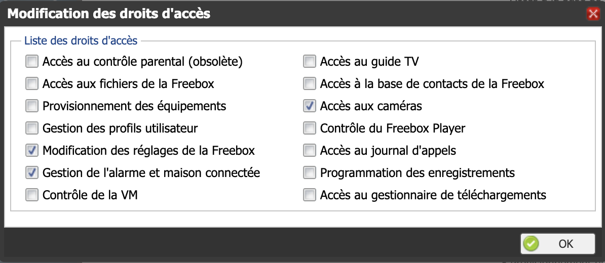

# homebridge-freebox-home-docker


## Requirement

- An initial homebridge instance with networking_mode host
- Configured config.json with freebox accessories see [this issue](https://github.com/fbx/homebridge-freebox-home/issues/3#issuecomment-658861450)
- Due to freebox API requirement all of the trafic needs to be on localhost

## Usage

```yml
freeboxapi:
    image: thomaslacaze/homebridge-freebox-home
    container_name: freeboxAPI
    restart: unless-stopped
    volumes:
        - $PWD/homebridge/config.json:/root/.homebridge/config.json:ro
        - $PWD/freeboxAPI/store:/usr/src/app/src/.store
    network_mode: host
```

After configuring the config.json with freebox accessories, you need create a token between your freebox and freebox API and give it three permsissions:

PS: token will be stored in 'store' file

```sh
curl http://localhost:8888/api/fbx/auth
```

